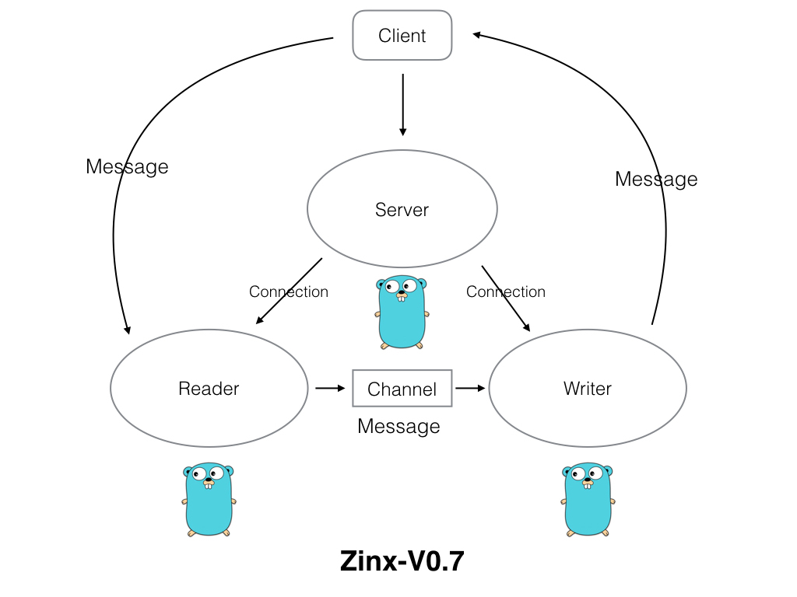
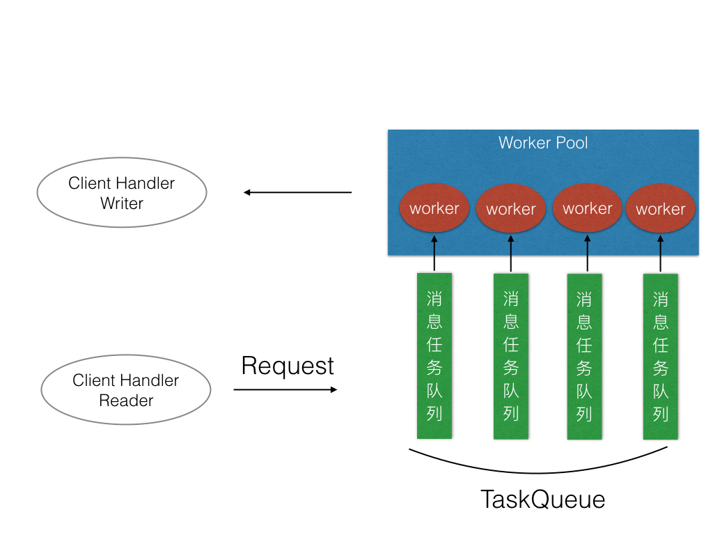

### 学习[Zinx](https://github.com/aceld/zinx)：基于Go的轻量级TCP并发服务器框架

* [Zinx官方文档](https://www.yuque.com/aceld/npyr8s)
* **v0.1**:基础server模块定义，实现
* **v0.2**:连接connection模块的封装，server与connection集成
* **v0.3**:Request请求模块、Router模块封装，框架集成
* **v0.4**:添加一个加载配置的模块，和一个全局获取Zinx参数的对象
* **v0.5**:消息的封装，封包与拆包
* **v0.6**:Zinx的多路由模式
* **v0.7**:Zinx的读写分离模型
  * 
  * 与客户端进修数据交互的Goroutine由一个变成两个，一个专门负责从客户端读取数据，一个专门负责向客户端写数据。
  * 目的就是高内聚，模块的功能单一，对于今后扩展功能更加方便。
* **v0.8**:Zinx的消息队列及多任务机制
  * 给Zinx添加消息队列和多任务Worker机制了：可以通过worker的数量来限定处理业务的固定goroutine数量，而不是无限制的开辟Goroutine；用消息队列来缓冲worker工作的数据。
  * 

* **v0.9**:Zinx的连接管理
  * Zinx框架增加连接个数的限定，如果超过一定量的客户端个数，Zinx为了保证后端的及时响应，而拒绝连接请求。
